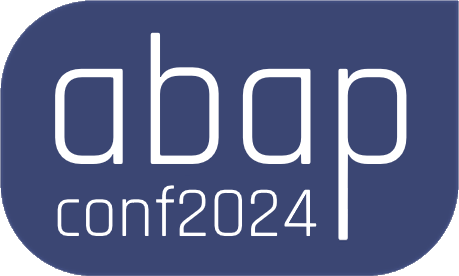

# 

# AbapConf2024: Setting Up On-Premise ABAP CI/CD with GitHub Actions  

Welcome to the **AbapConf2024** repository!

This project contains the source code showcased during the **AbapConf 2024** demo: **"Setting Up On-Premise ABAP CI/CD with GitHub Actions"**.

The demo follows concepts from [this article](https://community.sap.com/t5/application-development-discussions/making-an-onpremise-abap-ci-cd-with-github-actions/m-p/13884171), with updates reflecting the latest component changes.  

## 🛠 What’s the Demo About?  

Setting up a **CI/CD pipeline** using **GitHub Actions** for an **ABAP On-Premise** system.

In this repository there's the source code of an ABAP report that will validate with a regex an italian VAT number.

The unit tests in this package consist in testing the validity of that regex.

### Tools Used

- [**abapGit**](https://docs.abapgit.org/)  
- [**abapLint**](https://abaplint.org/)  
- [**ADASH**](https://github.com/xinitrc86/adash-cli)  
- [**TRM (Transport Request Manager)**](https://docs.trmregistry.com)  

### 📋 CI/CD Pipeline Breakdown 

  
      

1. **Code**  
   Developers create features and fix bugs in this stage.  

2. **Build**  
   In ABAP, the build process involves releasing a transport request, which converts ABAP code/objects into binary files.  

3. **Test**  
   - **Linter**: Checks that the ABAP code is syntactically correct.  
   - **Unit Tests**: Ensures features work and no breaking changes are introduced.  
   - Note: *While testing should ideally occur in a dedicated system, for simplicity, tests are run on the development system in this demo.*

4. **Release**  
   - After successful tests, a release is created with a version and dependencies.
     
    Each release of the software has a version and prerequisites/dependencies: the advantage of creating a release in this stage is assuring that whenever a specific version is installed and the prerequisites are ok, the release will work in a precise way.

5. **Deploy** *(Optional, but shown in the demo)*  
   - Automatic deployment to a target system with the latest features and fixes.  

## 🌍 Demo Environments  

| **Central Development System** (Source) | **Customer Development System** (Target) | **Customer Quality System** |  
|------------------------------------------|------------------------------------------|-----------------------------|  
| A4H (via [Nuve](https://www.nuveplatform.com/)) | RST | RGD |  

### Installed Software  

- **A4H (Source - Central Development System)**  
  - abapGit  
  - ADASH  
  - TRM  

- **RST (Target - Customer Development System)**  
  - TRM  

- **RGD (Customer Quality System)**  
  - No additional software is required.

Notice how no software/utility has to exist on RGD (**customer quality** system): the transport from development (RST) to quality (RGD) is **always done manually**.

## 🎥 Video Demo  

This section will be updated with links to the demo recording after **AbapConf2024** concludes.  

## 📑 Presentation  

You can find the conference presentation [here](presentation.pdf).  
